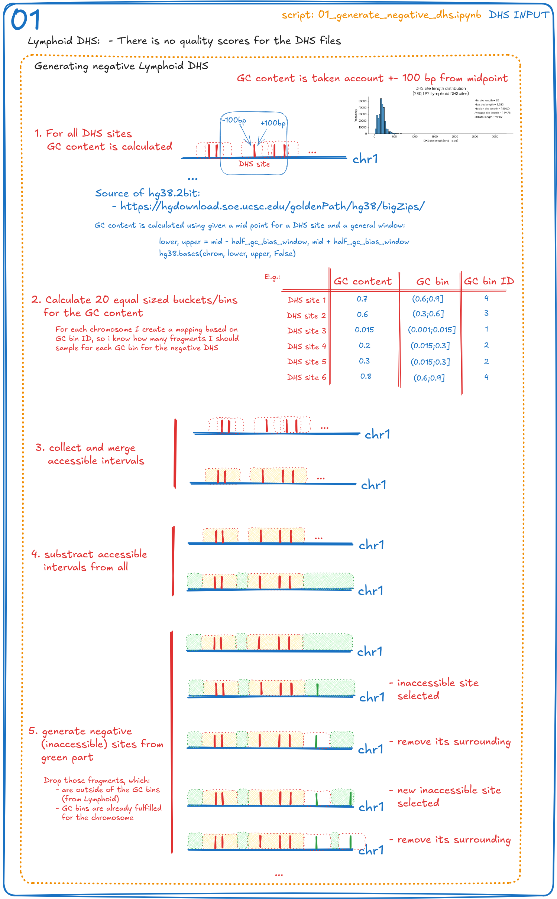
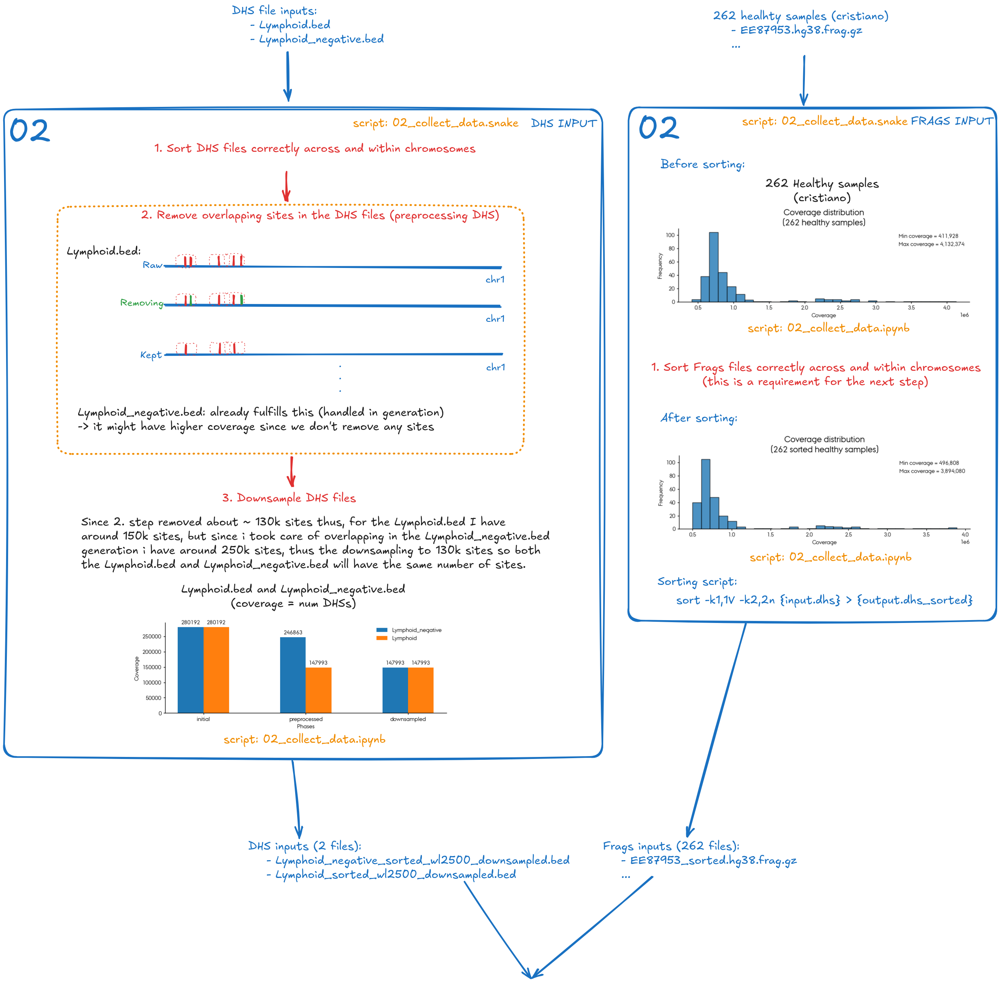
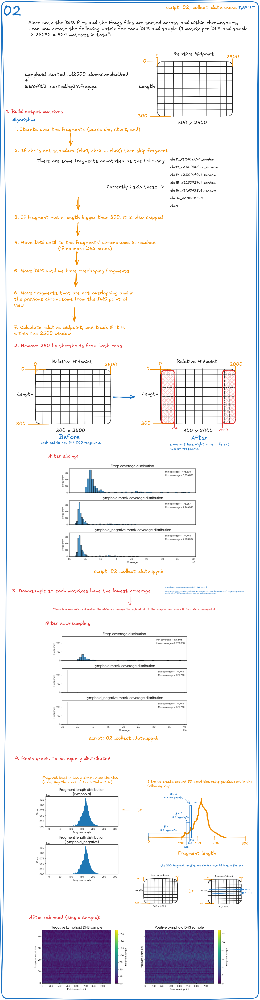
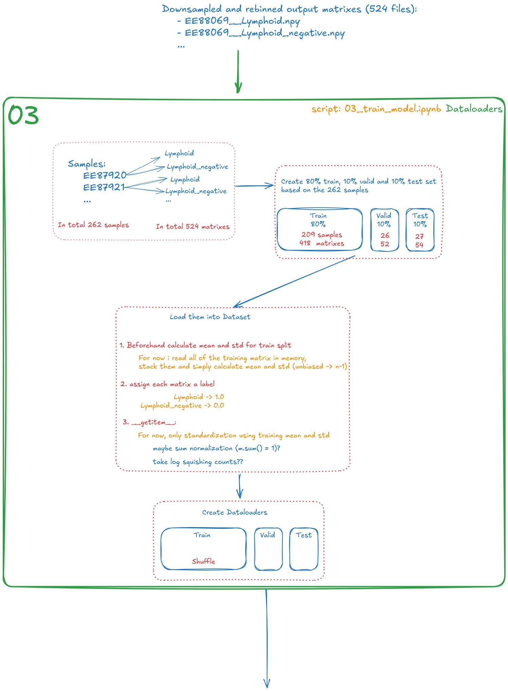
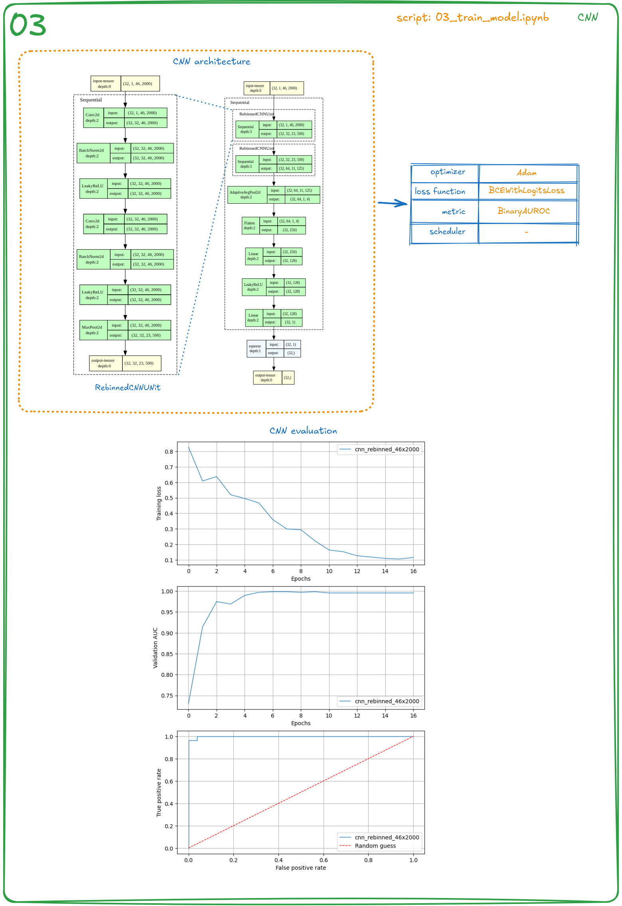
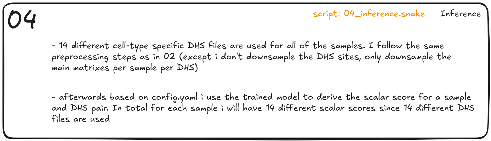

# Deep learning derived accessibility score

Deep learning-derived chromatin accessibility scores via supervised learning. First, synthetic non-DHS regions for the Lymphoid DHS sites are generated in a GC-bias-corrected fashion; these are referred to as negative Lymphoid sites (01). Healthy cfDNA fragment matrices are then constructed by collecting all fragments located within a specific window ($\pm$ 1000 bp) of both the Lymphoid DHS sites and the negative Lymphoid sites. In these matrices, two dimensions are encoded: the relative midpoint of the fragments on the x-axis and the fragment length on the y-axis. These are coverage-normalized via dynamic downsampling and rebinned into quantile-based fragment length bins (02). A CNN is trained on these matrices using Lymphoid DHS sites as positives and synthetic negatives as negatives (03). Finally, the trained model is used to calculate accessibility scores for unseen samples across 15 different cell-type-specific DHS sites, excluding the Lymphoid sites used during training (04).

## 01 - Generate negative Lymphoid sites (GC-bias-corrected)

## 02 - Preprocessing DHS and fragment input data

## 03 - Training supervised CNN model

## 04 - Inference using the trained CNN model

